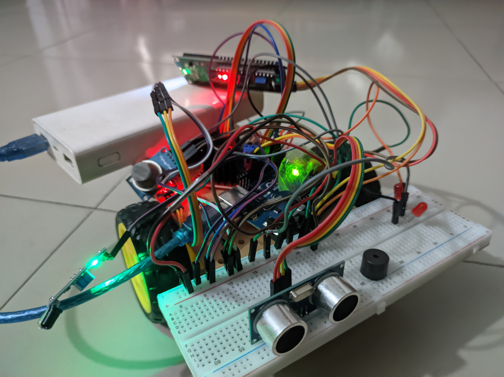

# Robotic Car Safety System Readme



Welcome to the Robotic Car Safety System project repository. This comprehensive document provides an in-depth overview of the project, its purpose, components, setup instructions, usage guidelines, contribution opportunities, and licensing information.

## Introduction

The Robotic Car Safety System is a sophisticated project designed to augment the safety features of a robotic car. By incorporating a variety of sensors and control mechanisms, the system ensures the safe operation of the robotic car in various environments. This project serves as an educational and practical platform for showcasing the integration of multiple sensors, actuators, and decision-making logic within the context of robotics.

## Components

- Arduino UNO
- LiquidCrystal I2C Display
- DHT11 Temperature and Humidity Sensor
- Ultrasonic Distance Sensor (HC-SR04)
- Gas Sensor
- Infrared (IR) Sensor
- Motor Controller Module (L298N)
- Various LEDs and buzzers

Libraries used:

  -Arduino-LiquidCrystal-I2C-library
  
  -DHT-sensor-library

  The system performs the following tasks:
1. **Obstacle Detection**: Utilizes the ultrasonic distance sensor to detect obstacles in front of the car. It adjusts the car's movement to avoid collisions.

2. **Gas Level Monitoring**: Monitors the gas sensor's analog input to detect harmful gas levels. If the gas value exceeds a threshold, the car stops and displays a warning message.

3. **Temperature Monitoring**: Reads the DHT11 sensor to measure temperature. If the temperature goes above a certain threshold, the system triggers a warning LED and displays a message on the LCD.

4. **Lane Detection**: Uses the IR sensor to detect lane markings. If the sensor value indicates the car is drifting off the lane, the car adjusts its movement to stay within the lane.

5. **LCD Display**: Shows real-time information such as gas levels, temperature, and distance on the LiquidCrystal I2C display.

6. **Motor Control**: Controls the car's movement based on sensor readings. It adjusts the speed and direction of the motors to navigate and respond to obstacles.

## Setup Instructions

1. Clone the repository to your local machine:

   ```shell
   git clone https://github.com/AshFahim/car-safety-arduino-project.git
   ```

2. Connect all the components according to the pin configuration specified in the code.

3. Upload the provided Arduino code (`project.ino`) to your Arduino board using the Arduino IDE.

4. Include
5. Power up the system and observe how the car reacts to different scenarios.

## Circuit Diagram


## Acknowledgements

This project was inspired by the need for smart and autonomous systems in the field of robotics. It's a beginner-friendly example that combines various sensors and motor control to create an interactive car control system.

## Contributions

Contributions to this project are welcome. If you find any issues or have ideas for improvements, feel free to create pull requests or open issues.
